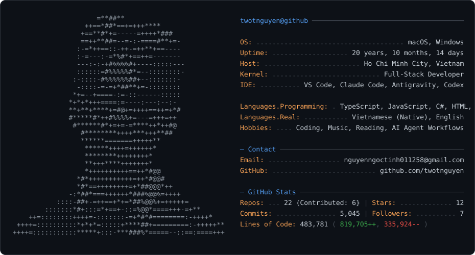

<div align="center">

<picture>
  <source media="(prefers-color-scheme: dark)" srcset="profile_dark.svg">
  <source media="(prefers-color-scheme: light)" srcset="profile_light.svg">
  
</picture>

</div>

---

<div align="center">

# Hi there, I'm Twot Nguyen 👋

[;Cross-Platform+Mobile+Creator+(Flutter);Desktop+%26+Tooling+Builder+(Tauri+%2F+Rust+%2F+C%23)>)](https://git.io/typing-svg)

[](https://github.com/twotnguyen)
[](https://github.com/twotnguyen)


</div>

---

## 👨‍💻 About Me

```json
{
  "name": "Twot Nguyen",
  "role": "Full-Stack Web Developer (TypeScript)",
  "based_in": "Ho Chi Minh City, Vietnam",
  "core_stack": ["TypeScript", "React", "NestJS", "PostgreSQL"],
  "other_tools": ["Flutter / Dart", "C# / .NET", "Python"],
  "side_quest": "Building developer tools and automation scripts",
  "motto": "Build robust, modular, and developer-friendly systems."
}
```

---

## 🎯 Current Focus

```text
🔭 Side project  Antigravity Cockpit (VS Code Extension)
💬 Ask me about  TypeScript, React, NestJS, PostgreSQL, REST APIs
⚡ Fun fact      I design custom AI agent rules & workflows to automate development
```

---

## 🛠️ Tech Stack & Skills

### 💻 Languages & Core Web
- **Core Stacks:** TypeScript, JavaScript, SQL (PostgreSQL)
- **Familiar / Academic:** C#, Python, Dart, C++, Java

### 🔧 Frontend & Mobile
- **Core Stacks:** React, Vite, Zustand, TanStack Query, Tailwind CSS
- **Familiar:** Flutter, Riverpod, HTML5/CSS3

### ⚙️ Backend & Systems
- **Core Stacks:** Node.js, NestJS, Express, Socket.IO, BullMQ
- **Familiar:** ASP.NET Core, SignalR, Deno

### 🗄️ Databases & DevOps
- **Core Stacks:** PostgreSQL, Redis, Docker, GitHub Actions
- **Familiar:** MS SQL Server, SQLite, Supabase, Playwright

---

## 📂 Featured Projects

### 🌍 [TravelConnectVN](https://github.com/twotnguyen/TravelConnectVN)
> **Full-Stack Travel Booking & Social Platform (React 19 / NestJS)**
- Built a two-sided travel marketplace with a monolithic **NestJS** backend (30 domain modules) and a **React 19** frontend (78 pages).
- Designed scalable asynchronous workflows utilizing **BullMQ** messaging queues and **Redis** cache.
- Integrated real-time chat gateways using **Socket.IO** backed by Redis scaling adapters.
- Implemented **Supabase Row-Level Security (RLS)** policies to restrict database tables securely.
- Integrated **Gemini AI** for interactive personalized itineraries creation and content moderation.

### 🔌 [PlantUML Importer](https://github.com/twotnguyen/staruml-plantuml-importer)
> **StarUML Extension for PlantUML Parsing & Auto-Layout (JavaScript)**
- Developed and published a StarUML plugin (5 ⭐ on GitHub) that parses PlantUML syntax and auto-generates 7 diagram types as native models.
- Implemented an enhanced **Sugiyama hierarchical layout algorithm** for Class diagrams and a dynamic grid layout for Activity diagrams.
- Maintained a regression test suite with 30+ fixtures and cross-platform installation tools.

### ⚽ [GoalTrack](https://github.com/twotnguyen/goal-track)
> **Live football match-tracking site & automated update pipeline (🟢 Live)**
- Shipped and deployed a live football match-tracking site (`twotnguyen.github.io/goal-track`) built with vanilla JS and custom CSS in 2 days.
- Built a Playwright-based scraper in Node.js extracting live scores from JS-heavy sites with change-detection logic.
- Automated a self-updating data pipeline via GitHub Actions (cron every 4 hours) that scrapes, diffs, and commits back to the repo autonomously.

### 🚀 [Antigravity Cockpit](https://github.com/twotnguyen/antigravity-cockpit)
> **VS Code Extension Productivity Tooling (TypeScript)**
- Developed a high-performance productivity tool for VS Code using **TypeScript** and the **VS Code Extension API**.
- Implemented a premium **floating card overlay (HUD)** inside the editor workspace via WebView.
- Integrated **WebAssembly sql.js** to run database analytics against editor state files (`state.vscdb`) locally.


---

## 📊 Activity & Contributions

<div align="center">

[](https://github.com/anuraghazra/github-readme-stats)

[](https://github.com/twotnguyen)

### 🐍 Contribution Snake


</div>

---

<div align="center">

### 💡 Quote of the Day

{QUOTE_HERE}

</div>

---

<div align="center">


_One must imagine a system happy._

</div>
